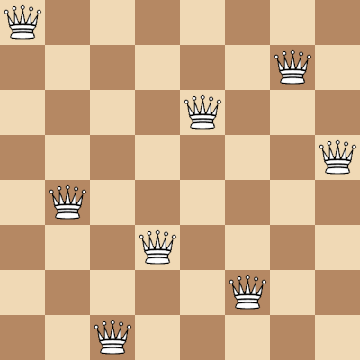

# PyEightQueen

A Python project for solving 8 queens problem and visualizing it using OpenCV library.



### Table of Contents

1. [Introduction](#introduction)
1. [Requirements and Dependencies](#requirements-and-dependencies)
1. [Installation](#installation)
1. [Running](#running)

### Introduction

Here is the Wikipedia explanation at [this](https://en.wikipedia.org/wiki/Eight_queens_puzzle) link for the 8 queens problem:

> The eight queens puzzle is the problem of placing eight chess queens on an 8×8 chessboard so that no two queens threaten each other; thus, a solution requires that no two queens share the same row, column, or diagonal. The eight queens puzzle is an example of the more general n queens problem of placing n non-attacking queens on an n×n chessboard, for which solutions exist for all natural numbers n with the exception of n = 2 and n = 3.

This problem can also be solved with brute force (by trying all possibilities). If we wanted to solve this problem with brute force on an 8x8 chessboard, the cost of trying all combinations would be:


Instead of trying all (4,426,165,368) possibilities with the solution in this repository; It is calculated by reducing the 2-dimensional chessboard to one dimension and using column indexes over one dimension. Cost after this reduction for
8x8 chessboard:


### Requirements and Dependencies

[Python](https://www.python.org/) 3.7 or higher is required to run the project.

Also [OpenCV](https://opencv.org/) library is required for visualization. You can build OpenCV from source code or install it using [PyPI](https://pypi.org/project/opencv-python/) as described in the [Installation](#installation) section.

### Installation

Clone the project with:

```bash
git clone https://github.com/YusufBerki/PyEightQueen.git
```

To install the required libraries, go to project directory and run the following code:

```bash
pip install -r requirements.txt
```

### Running

Run the following code to see the solutions for the 8x8 chessboard:

```bash
python main.py
```

Can change [this line](https://github.com/YusufBerki/PyEightQueen/blob/e065f2d1862191c6825ba71780e39f0b9c041cc9/main.py#L64) to see the results on different sizes of chessboard.

### Contact

[Yusuf Berki YAZICIOĞLU](mailto:mail@yusufberki.net)

### License

See [MIT License](https://github.com/YusufBerki/PyEightQueen/blob/master/LICENSE)
